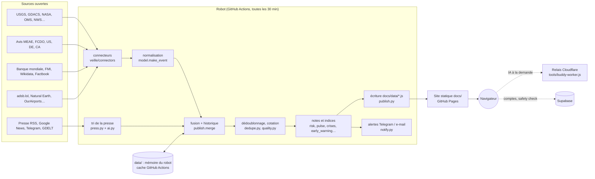

# Architecture

## En une phrase

Un **robot Python** (`collecte.py`) lit toutes les 30 minutes des sources ouvertes, les traduit dans un
**format d'événement unique**, calcule notes et indices, puis écrit des **fichiers JavaScript de données**
dans `docs/data/`. Le **site statique** `docs/` (HTML + JavaScript sans framework ni compilation) lit ces
fichiers et affiche carte, onglets et rapports. Il n'y a **pas de serveur applicatif** : GitHub Actions
exécute le robot, GitHub Pages sert le site.

## Chaîne de collecte (`collecte.py`, fonction `main`)

| Étape | Code | Rôle |
|---|---|---|
| 1. Chargement | `config.load_json`, `publish.load_store` | Configuration (`config/*.json`), secrets (`.env` ou variables d'environnement), mémoire du robot (`data/store.json`) |
| 2. Préchargement | `prefetch_feeds` | Téléchargement parallèle de tous les flux RSS déclarés |
| 3. Connecteurs | `REGISTRY[src["type"]].fetch(src, ctx)` | Une source par module. Une panne ne bloque jamais les autres ; 3 échecs de suite = pause de 24 h. État dans `store["status"]` |
| 4. Presse | `ai.analyze`, `press.build` | Tri des titres par mots-clés (+ IA si clé), géolocalisation, langue |
| 5. Fusion | `publish.merge` | Ajout à l'historique (rétention 95 jours), fil d'actualité, veille économique |
| 6. Qualité | `dedupe.dedupe`, `quality.learn`, `quality.filter_and_rate` | Fusion des doublons, validations de l'analyste (`config/verified.json`), cotation de l'Amirauté A1–F6, apprentissage de la fiabilité par source |
| 7. Indices | `risk.compute`, `pulse.compute`, `crises.build`, `agenda.update`, `reports.update`, `early_warning.update`, `traffic.update`, `country_detail.build`, `profiles.build`, `practical.update` | Note de risque pays, indice Pulse, chronologies de crise, agenda, rapports, alerte précoce, trafic, fiches pays |
| 8. Alertes | `notify.send`, `notify.send_digest` | Telegram et e-mail (incidents graves, point quotidien) |
| 9. Publication | `publish.write_outputs`, `write_js`, `legal.write`, `accounts.ping`, `bust_cache`, `save_store` | Fichiers `docs/data/*.js`, empreinte de version dans les pages HTML, sauvegarde de la mémoire |

Chaque étape « annexe » (7) est encadrée par un `try/except` qui journalise l'erreur sans arrêter la collecte.

## Modules Python (`veille/`)

| Module | Responsabilité |
|---|---|
| `config.py` | Lecture de `config/*.json`, de `.env` et des secrets |
| `http.py` | Seul point d'accès réseau : délais, relances, authentification des sources payantes |
| `model.py` | Format d'événement standard, taxonomie (catégories, gravité, niveaux de risque) — **source de vérité unique** des libellés |
| `geo.py` | Pays (Natural Earth), point dans polygone, distances, alias de noms |
| `connectors/` | Un module par source (voir [CONNECTEURS.md](CONNECTEURS.md)) |
| `press.py` | Tri des titres de presse : catégories par mots-clés multilingues, faux positifs, géolocalisation, langue |
| `ai.py`, `llm.py` | Socle IA (Anthropic) : budget, cache, tâches activables ; tout est facultatif |
| `dedupe.py` | Fusion des doublons (même lieu, même famille, mots communs) |
| `quality.py` | Cotation de l'Amirauté, validations de l'analyste, qualité mesurée par source |
| `risk.py` | Note de risque pays 1–5 (avis officiels + activité sécuritaire + catastrophes) |
| `pulse.py` | Indice de stabilité 0–100 et ses causes |
| `crises.py` | Chronologies de crise (incidents liés sur plusieurs jours) |
| `agenda.py` | Jours fériés, élections, fêtes religieuses |
| `reports.py` | Agrégateur de rapports (think tanks, OI, ONG) |
| `early_warning.py`, `admin1.py` | Alerte précoce climat-conflit par région administrative |
| `country_detail.py`, `fcdo.py` | Fiches pays détaillées (villes, aéroports, secours, santé, texte FCDO) |
| `traffic.py` | Instantané du trafic aérien (adsb.lol) |
| `profiles.py`, `practical.py` | Profils économiques et informations pratiques (Banque mondiale, FMI, Wikidata) |
| `enrich.py` | Titres d'articles pour les événements GDELT |
| `analytics.py` | Statistiques par pays et séries temporelles pour l'onglet Analyses |
| `notify.py` | Alertes Telegram / e-mail, point quotidien |
| `providers.py` | Annuaire des prestataires : fiches inscrites (Supabase, clé publique) + repérés par Angor → `docs/data/providers.js` |
| `legal.py` | Informations légales : `config/legal.json` → `docs/data/legal.js` (+ licences des sources, champs manquants) |
| `accounts.py` | Signe de vie à la base Supabase à chaque collecte (projet gratuit maintenu actif) |
| `publish.py` | Mémoire du robot, fusion, écriture des fichiers publiés, archives, empreintes de cache |

Scripts hors robot : `historique.py` (base historique sur 5 ans, lancé à la main), `tools/` (outils ponctuels :
reconstruction des pays, sources presse, évaluation du tri, relais IA Cloudflare, modèles de workflow).

## Site (`docs/`)

Pages statiques, JavaScript « vanilla » en modules auto-exécutés (IIFE), aucune étape de compilation.
Bibliothèques recopiées dans `docs/vendor/` (Leaflet, MarkerCluster, MapLibre, Chart.js, icônes Lucide).
Détails : [FRONTEND.md](FRONTEND.md).

| Page | Scripts | Rôle |
|---|---|---|
| `index.html` | `app.js` (+ `ew.js`, `gonogo.js`, `account.js`) | Carte et tous les onglets |
| `report.html` | `report.js`, `dossier.css` | Rapport pays (écran + PDF A4) |
| `brief.html` | `brief.js`, `report.css` | Brief de mission |
| `aide.html` | — | Aide utilisateur |
| `compte.html`, `admin.html` | `compte.js`, `admin.js`, `account.js` | Comptes, administration (Supabase) |
| `prestataire.html` | `prestataire.js`, `providers-lib.js`, `account.js` | Espace prestataire (fiche, justificatifs, photos, demandes, avis) et fiche publique |
| `legal.html`, `mentions-legales.html`, `cgu.html`, `cgv.html`, `confidentialite.html`, `sous-traitance.html`, `licences.html` | `legal.js`, `legal.css` | Informations légales (contenu variable : `config/legal.json`) |
| `sw.js`, `manifest.webmanifest` | — | Application installable, cache hors ligne |

## Services externes

| Service | Usage | Où |
|---|---|---|
| GitHub Actions | Robot de collecte (`.github/workflows/collecte.yml`), historique, tests | Dépôt |
| GitHub Pages | Hébergement du site (`docs/`), domaine angor.fr | Dépôt |
| Cache GitHub Actions | Mémoire du robot (`data/`) entre deux collectes, sans commit | `collecte.yml` |
| Cloudflare Worker | Relais IA (la clé Anthropic ne peut pas être dans un site public) | `tools/buddy-worker.js` |
| Supabase | Comptes, validation admin, safety check, notifications, déclenchement d'une collecte | `supabase/` |
| Anthropic API | Tri et résumés (robot), Travel buddy (relais) — facultatif | `veille/llm.py` |

## Principes de conception (à préserver)

1. **Gratuit par défaut** : toute fonction doit marcher sans clé payante ; une clé ajoute de la qualité, jamais une dépendance.
2. **Une source en panne ne casse rien** : chaque connecteur et chaque étape annexe est isolée.
3. **Aucun secret dans le dépôt ni dans le site** : `.env` et GitHub Secrets uniquement ; le site ne reçoit que des données publiques.
4. **Les sites clients ne sont jamais publiés** (`VS_PUBLIC=1` en ligne, `SITES_JSON` en secret).
5. **Événements, jamais personnes** (RGPD) ; **titre + résumé + lien**, jamais l'article complet (droit d'auteur) ; licence de chaque source respectée.
6. **Une seule source de vérité** pour la taxonomie (`model.py`, exportée dans `data.js`).
